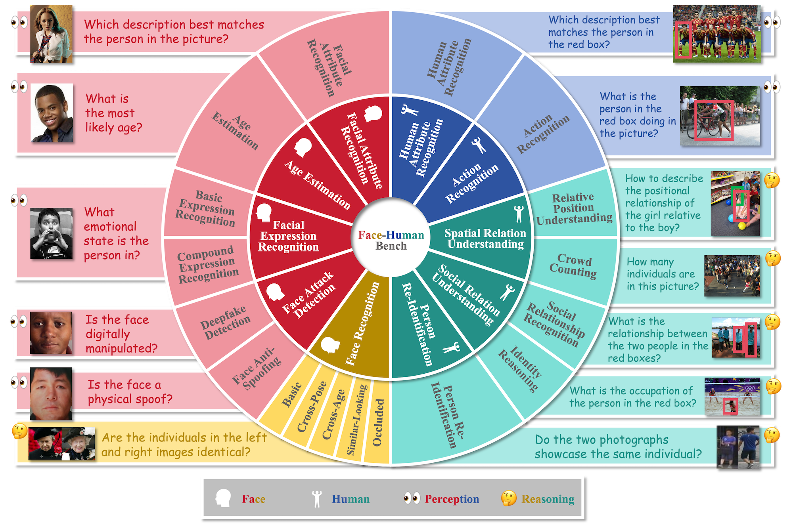

# [NeurIPS 2025] Face-Human-Bench: A Comprehensive Face and Human Understanding Benchmark for Large Visual Language Models

<p align="center">
     <br>
</p>


## Introduction

Faces and humans are crucial elements in social interaction and are widely included in everyday photos and videos. Therefore, a deep understanding of faces and humans will enable multi-modal assistants to achieve improved response quality and broadened application scope. Currently, the multi-modal assistant community lacks a comprehensive and scientific evaluation of face and human understanding abilities. In this paper, we first propose a hierarchical ability taxonomy that includes three levels of abilities. Then, based on this taxonomy, we collect images and annotations from publicly available datasets in the face and human community and build a semi-automatic data pipeline to produce problems for the new benchmark. Finally, the obtained Face-Human-Bench includes a development set and a test set, each with 1800 problems, supporting both English and Chinese. We conduct evaluations over 25 mainstream multi-modal large language models (MLLMs) with our Face-Human-Bench, focusing on the correlation between abilities, the impact of the relative position of targets on performance, and the impact of Chain of Thought (CoT) prompting on performance. We also explore which abilities of MLLMs need to be supplemented by specialist models. The data and evaluation code of the Face-Human-Bench will be made publicly available.

 


## Data Acquisition
We comply with all agreements of the original public datasets used and do not involve further copying, publishing, or distributing any portion of the images from these datasets. We will only open-source the [JSON files](data) containing our test and development sets.
We also provide [Hugging Face](https://huggingface.co/datasets/InQ2025/Face-Human-Bench) data download links.

To help you reproduce the Face-Human-Bench Benchmark, we provide the following guidelines:

1. Download all original images from the relevant public datasets and organize them according to the file tree below.

```
<your_path>/raw_data
├── face
│   ├── CALFW
│   │   ├── calfw
│   │   └── calfw.zip
│   ├── CelebA
│   │   ├── img_align_celeba
│   │   ├── img_celeba
│   │   └── list_attr_celeba.txt
│   ├── CPLFW
│   │   ├── cplfw
│   │   └── cplfw.zip
│   ├── FF+
│   │   └── cropped
│   ├── LFW
│   │   ├── data
│   │   └── pairs.txt
│   ├── MLFW
│   │   ├── aligned
│   │   ├── mask_list.txt
│   │   ├── MLFW.zip
│   │   ├── origin
│   │   └── pairs.txt
│   ├── RAF-DB
│   │   ├── basic
│   │   └── compound
│   ├── SiW-Mv2
│   │   └── cropped
│   ├── SLLFW
│   │   └── pair_SLLFW.txt
│   └── UTKFace
│       ├── cropped
│       ├── part1
│       ├── part2
│       └── part3
└── human
    ├── HICO-DET
    │   ├── anno
    │   ├── HICO-DET
    │   ├── HICO-DET.tar.gz
    │   ├── metafile.yaml
    │   └── README.md
    ├── Market1501
    │   ├── distractors_500k.zip
    │   ├── Market-1501-v15.09.15
    │   └── Market-1501-v15.09.15.zip
    ├── PISC
    │   ├── annotation_image_info.json
    │   ├── domain.json
    │   ├── domain_split
    │   ├── domain_split.zip
    │   ├── image
    │   ├── images-00
    │   ├── images-01
    │   ├── images-02
    │   ├── images-03
    │   ├── occupation.json
    │   ├── relationship.json
    │   ├── relationship_split
    │   ├── relationship_split.zip
    │   └── test
    ├── ShTech
    │   ├── final_partA
    │   ├── final_partA.zip
    │   ├── ShanghaiTech_Crowd_Counting_Dataset
    │   └── ShanghaiTech_Crowd_Counting_Dataset.zip
    ├── SpatialSense
    │   ├── annotations.json
    │   ├── images
    │   ├── images.tar.gz
    │   └── SHA-256.txt
    └── WIDERAttribute
        ├── Image
        ├── Readme.txt
        ├── wider_attribute_annotation.zip
        ├── wider_attribute_image.tgz
        ├── wider_attribute_test.json
        └── wider_attribute_trainval.json
```

    CALFW: http://whdeng.cn/CALFW/
    CelebA: https://mmlab.ie.cuhk.edu.hk/projects/CelebA.html
    CPLFW: http://www.whdeng.cn/cplfw/
    FF+: https://github.com/ondyari/FaceForensics
    LFW: https://vis-www.cs.umass.edu/lfw/
    MLFW: http://www.whdeng.cn/MLFW/
    RAF-DB: http://www.whdeng.cn/RAF/model1.html
    SiW-Mv2: https://cvlab.cse.msu.edu/siw-mv2-dataset.html
    SLLFW: http://www.whdeng.cn/SLLFW/
    UTKFace: https://susanqq.github.io/UTKFace/
    HICO-DET: https://www.v7labs.com/open-datasets/hico-det
    Market1501: https://zheng-lab.cecs.anu.edu.au/Project/project_reid.html
    PISC: https://zenodo.org/records/1059155
    ShTech: https://github.com/desenzhou/ShanghaiTechDataset
    SpatialSense: https://github.com/princeton-vl/SpatialSense
    WIDERAttribute: https://mmlab.ie.cuhk.edu.hk/projects/WIDERAttribute.html

   
2. Use the [`prepare_data.py`](code/prepare_data.py) script to extract test samples from the original images based on the JSON files we provide. Note: You will need to modify the paths in the script to match your local environment. 


## Evaluation

To evaluate on our benchmark, execute the following scripts in order: [`eval.py`](code/evaluation/eval.py), [`output_final_answer.py`](code/evaluation/output_final_answer.py), and [`score.py`](code/evaluation/score.py). Each script serves a distinct purpose:

- `eval.py`: Obtains the output from the MLLM.
- `output_final_answer.py`: Extracts the final answer from the MLLM's output.
- `score.py`: Calculates the scores for the Face-Human-Bench based on the final answers.

These scripts are provided as an example with GPT-4o to test. Before running them, update the file paths and API settings as indicated by the "TODO" comments in the code to match your local setup and the API you intend to test.


